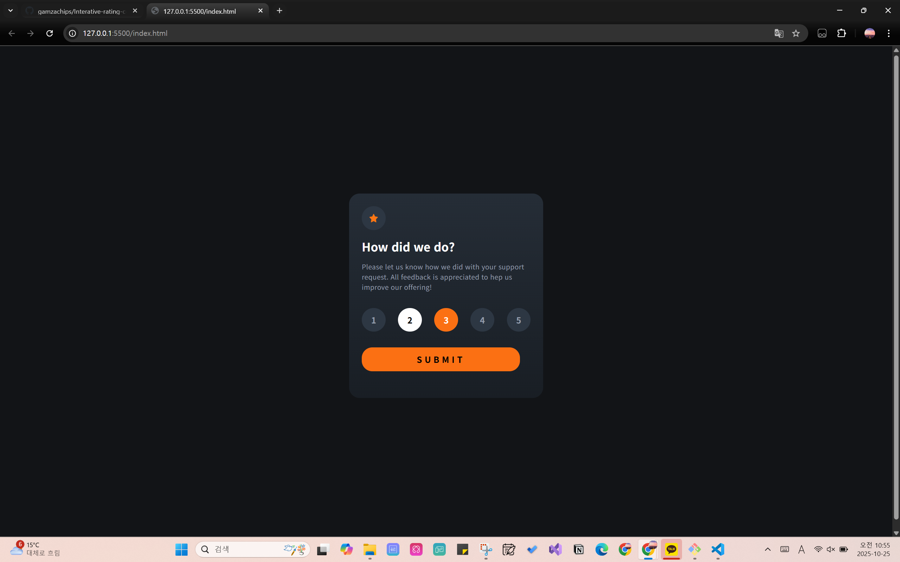
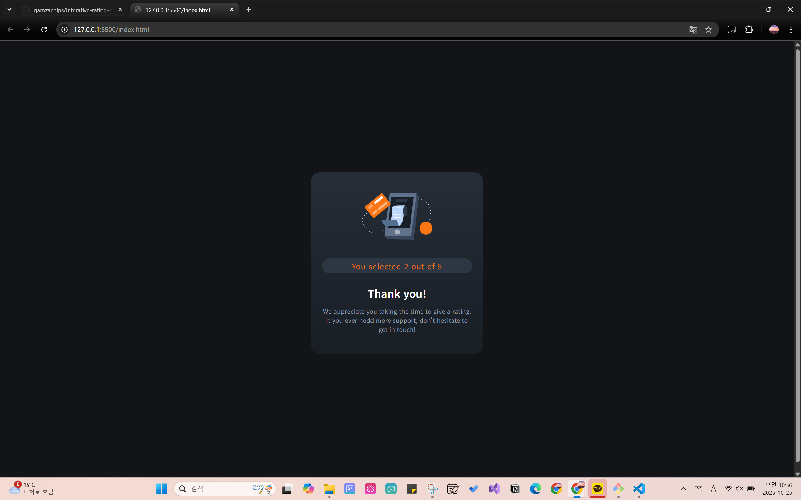
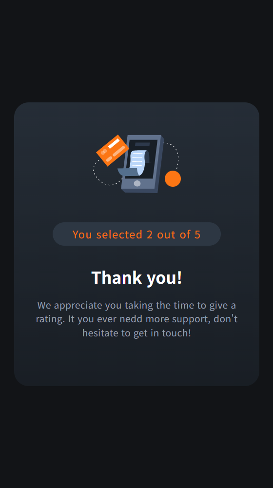

# Frontend Mentor - Interactive rating component solution

This is a solution to the [Interactive rating component challenge on Frontend Mentor](https://www.frontendmentor.io/challenges/interactive-rating-component-koxpeBUmI). This project helped me understand how to structure a simple interactive UI using HTML, CSS, and JavaScript, and how to handle user input dynamically. 


## Overview

### The challenge

Users should be able to:

- View the optimal layout for the app depending on their device's screen size
- See hover states for all interactive elements on the page
- Select and submit a number rating
- See the "Thank you" card state after submitting a rating

### Screenshot






### Links

- Solution URL: [Github](https://github.com/gamzachips/Interative-rating-component)
- Live Site URL: [Live](https://gamzachips.github.io/Interative-rating-component/)

## My process

### Built with

- Semantic HTML5
- CSS 
- Vanilla JavaScript


### What I learned

This was my first time creating an interactive component from scratch.
I learned how to:

Handle dynamic state changes with JavaScript (.classList.add() / .remove())

Use Flexbox effectively for vertical and horizontal centering

Apply responsive design using @media queries

Add transitions and hover effects for smoother UI feedback


```js
buttons.forEach((btn) => {
  btn.addEventListener("click", () => {
    buttons.forEach((b) => b.classList.remove("selected"));
    btn.classList.add("selected");
  });
});
```

### Continued development

In future projects, I’d like to:
- Improve accessibility (keyboard navigation and ARIA roles)
- Add animations for smoother state transitions
- Explore using small frameworks (React or Vue) for dynamic UI handling


## Author

- Website - [gamzachips Tistory](https://gamzachips.tistory.com/)
- Frontend Mentor - [@gamzachips](https://www.frontendmentor.io/profile/gamzachips)